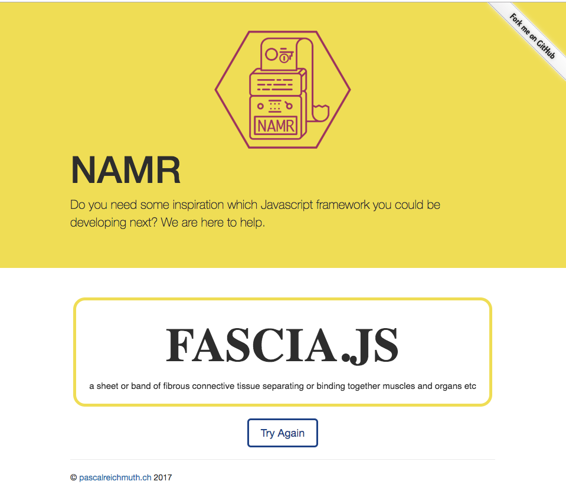

build-lists: true
theme: Sketchnote,1

# Improving on Express

## by Brian Schiller

brian@brianschiller.com

Software Engineer at Devetry

Twitter, Github, DenverDevs: @bgschiller

<br>
These slides: github.com/bgschiller/improving-on-express

---
[.autoscale: true]

## What's even wrong with express?

- uses callbacks for everything (predates native `Promise`)
- too many ways to "return" from a middleware
  - call `next()`
  - call `next(err)`
  - `res.send()` a response, never call `next()`
  - return without doing any of these
  - throw an error
- impossible to write "type-aware middleware"

---

## "Type-aware middleware", what's that?

```javascript
app.post('/favorite', passport.authenticate(), (req, res) => {
  // req.user should be available
  // because of passport.authenticate
});
```

---

## "Type-aware middleware", what's that?

```javascript
app.post('/favorite', passport.authenticate(), (req, res) => {
  // req.user should be available
  // because of passport.authenticate
});
```

```javascript
app.get('/news', (req, res) => {
  // req.user should be undefined because
  // we didn't include passport.authenticate
});
```

---


---

## How is `req.user` typed?

```typescript
declare global {
  namespace Express {
    interface Request {
      user?: any;
    }
  }
}
```

---

## How is `req.user` typed?

```typescript
declare global {
  namespace Express {
    interface Request {
      user?: any;
    }
  }
}
```

Adds a possibly-undefined `req.user` to _every_ request

---

## How is `req.user` typed?

```typescript
declare global {
  namespace Express {
    interface Request {
      user?: any;
    }
  }
}
```

Adds a possibly-undefined `req.user` to _every_ request


---

# Livecoding, part 1

---
[.autoscale: true]

## Remember our complaints?

- uses callbacks for everything
  - change callbacks to promises
- too many ways to "return" from a middleware
  - remove `next()` in favor of explicit returns
  - add an error handler (easier now that we're using promises)
- impossible to write "type-aware middleware"
  - we can do this with promise chains

---

Introducing...

# [fit] Fascia

- Where'd that name come from?

---



---

# Livecoding, part2

---
## pg-resource

automatic type-checked CRUD

---

## pg-resource

```typescript
const TalkV = t.type({
  id: t.number,
  user_id: t.number,
  title: t.string,
  description: t.string,
});
type Talk = t.TypeOf<typeof TalkV>;

const talkCrud = pgResource<Talk>({ db, tableName: 'talk' });
```

---

```typescript
app.patch(
  // to update a talk, send a PATCH request
  '/talks/:id', // to this endpoint
  withConnection(
    conn =>
      // you must be logged in
      requiresLogin(conn)
        // Look to the :id in the url params for which talk
        .then(itemIdFromUrl('id'))
        // you must own the talk in question
        .then(mustOwnTalk)
        // request body must match this interface
        .then(decodeBody(CreateUpdateTalkV))
        // actually update in the db
        .then(talkCrud.update)
        // respond with json
        .then(jsonFrom('row'))));
```

---
## Drawbacks

- Code is sometimes a bit longer
- Relies on a pretty strong knowledge of TypeScript
- "What's this `fascia` thing?

---

## Next steps

- Give it a try! `npm install fascia@next`
- Open to contributors at `github.com/bgschiller/fascia`
- Better docs, more examples

---

# [fit] Thank you!

<br>
brian@brianschiller.com

Twitter, Github, DenverDevs: @bgschiller

These slides: github.com/bgschiller/improving-on-express